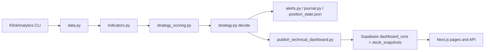
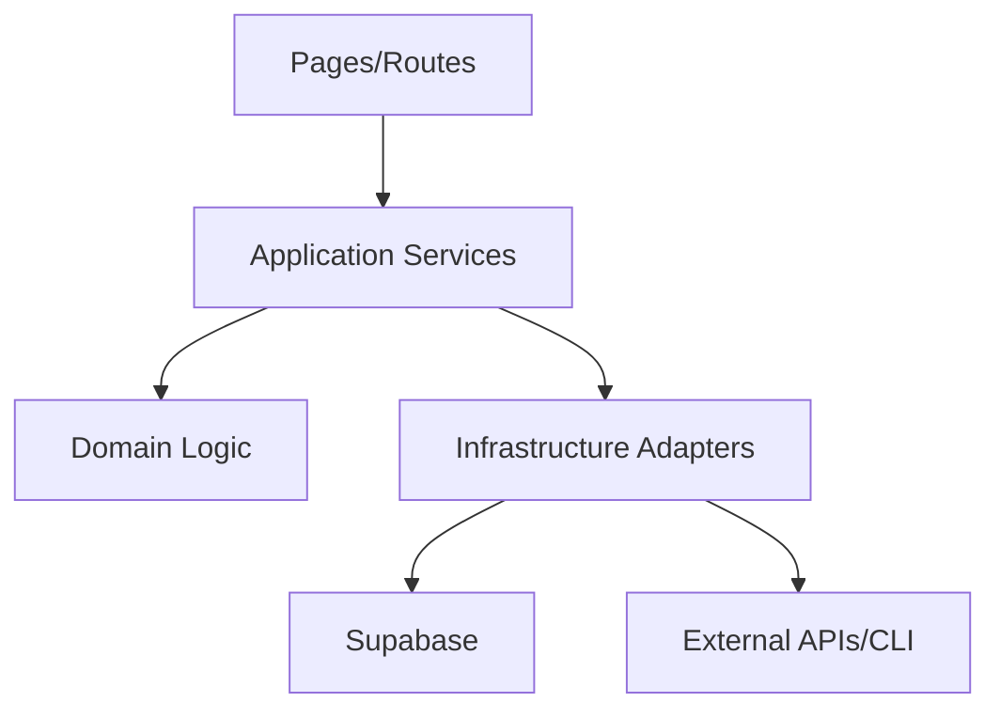

# Architecture Overview

Last reviewed: 2026-05-06

## System Context

The repository contains two connected systems:

1. **Python Signal Engine**: fetches market data, computes indicators/scores, decides alerts, emits output, and supports backtesting/research workflows.
2. **Next.js Dashboard**: presents technical snapshots + market news, with API routes for ingest and query, backed by Supabase.

## Technology Stack

| Layer | Technology |
|---|---|
| Signal engine | Python, pandas, requests, KlickAnalytics CLI |
| Web app | Next.js App Router, React, TypeScript |
| Data store | Supabase Postgres |
| Scheduling | Render worker/cron (Python); Vercel cron (dashboard ingest) |
| Messaging | Discord webhook |

## Repository Responsibilities

| Path | Responsibility |
|---|---|
| `main.py` | CLI entrypoint using extracted runtime modules |
| `cli_args.py` | CLI parser and argument contract |
| `runtime_logging.py` | Structured JSON logging utilities |
| `health_check.py` | Non-destructive runtime health checks |
| `data.py` | Market data ingest via external CLI |
| `indicators.py` | Indicator computation primitives |
| `strategy_scoring.py` | Weighted scoring model |
| `strategy.py` | Backward-compatible facade over split strategy modules |
| `strategy_types.py` | Shared strategy dataclasses and domain types |
| `strategy_position.py` | Position persistence and blocked-date loading |
| `strategy_decision.py` | Core state transition and decision engine |
| `strategy_formatting.py` | Technical breakdown formatting |
| `publish_technical_dashboard.py` | Batch technical snapshot publisher to Supabase |
| `dashboard/app/` | Routes and pages |
| `dashboard/lib/news/` | News provider, normalization, enrichment, querying |
| `dashboard/lib/technical/` | Technical snapshot querying/types |
| `dashboard/lib/supabase/` | Service client creation |
| `dashboard/supabase/migrations/` | DB schema evolution |

## Data Flow

## 1) Technical Signals



## 2) News Pipeline

```mermaid
flowchart LR
  A[Finnhub API] --> B[/api/news/ingest]
  B --> C[runNewsIngest service]
  C --> D[provider fetch + finalize + upsert]
  D --> E[Supabase market_news + news_ingest_runs]
  E --> F[/api/news/market and /api/news/ticker]
  F --> G[/market-news and /stock/[ticker]]
```

## Service Boundaries

- **Signal policy boundary:** should be pure decision logic independent from output formatting and persistence.
- **Ingestion boundary:** provider fetch/normalization should be separate from route auth/HTTP concerns.
- **Persistence boundary:** DB adapters should expose narrow interfaces, avoiding broad direct service-role usage in mixed layers.

## Dependency Flow (Target Direction)



Current state now follows this model more closely after strategy/runtime module extraction and ingest service refactoring.

## Key Patterns in Use

- Cached query reads with tag revalidation for dashboard freshness.
- Batch snapshot publishing for technical leaderboard.
- Rule-based technical decisioning with configurable thresholds and regime logic.
- Operational scripts for scheduled execution.
- API observability with request IDs and latency headers.

## Architectural Concerns

1. **Backtest module size**: research modules remain comparatively large and should be decomposed next.
2. **API versioning gap**: route contracts are structured but not versioned (`/api/v1` not introduced yet).
3. **Validation standardization**: route validation exists but should be schema-driven across all endpoints.
4. **Observability depth**: request IDs/latency exist; metrics backend and alerting are still pending.

## Suggested Diagram Set for Ongoing Documentation

- C4 Level 1: system context (operators, data providers, dashboard).
- C4 Level 2: containers (Python service, Next.js app, Supabase DB).
- Sequence diagrams:
  - live signal run
  - news ingest run
  - technical revalidate flow
- Domain model diagram:
  - indicator snapshot
  - weighted score breakdown
  - decision state transitions (flat/long TQQQ/long SQQQ).

## Suggested Architecture Decisions (ADRs)

- ADR-001: Alert-only boundary and no trade execution.
- ADR-002: Supabase as operational store for dashboard.
- ADR-003: Regime-aware weighted scoring approach.
- ADR-004: Cache strategy and revalidation triggers.
- ADR-005: API error contract and versioning.
